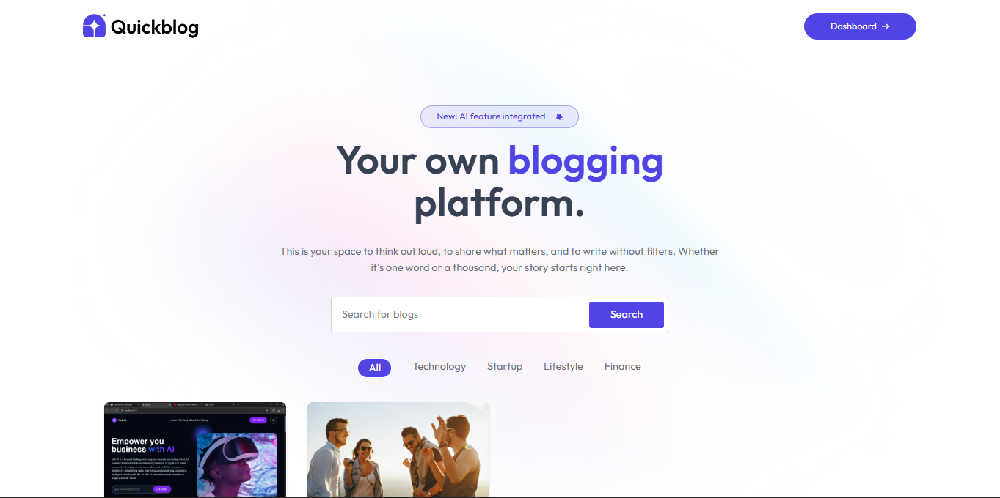

# QuickBlog – AI-Powered MERN Blog App

QuickBlog is a full-stack blog platform built with the MERN stack, Google Gemini, and ImageKit. It lets you create, edit, and manage posts with an AI-powered writing tool and an easy-to-use admin panel.



## Features

- AI-powered blog generation with Google Gemini
- Image upload and optimization using ImageKit
- CRUD operations for posts
- Admin panel for managing blogs
- Responsive React frontend and secure Express backend

## Tech Stack

- MongoDB, Express, React, Node.js
- Google Gemini API
- ImageKit API

## Live Preview

Check out the live version of the app here:  
[https://quick-blog-natnael.vercel.app/](https://quick-blog-natnael.vercel.app/)

## Setup

```bash
git clone https://github.com/natitam1/QuickBlog-Natnael
cd client
npm install
npm run dev
```
